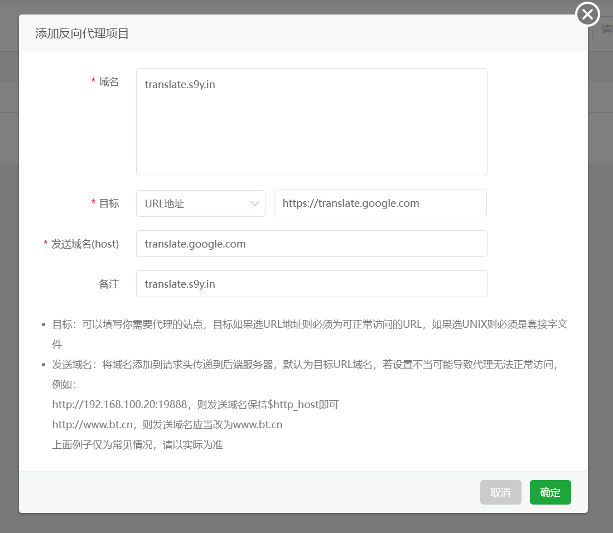

# 兼容DeepLX的谷歌微软翻译Api


## 如何使用

使用Post提交参数即可

## 免费吗？

免费，接口均提取自网页版接口

## 支持高并发吗？

支持，你可以根据你服务器的能力来调整

在jar包同级目录新建application.yml,输入下面的内容适当调整即可，实际测试我并发设置15没任何问题

```yaml
server:
  port: 6060
  servlet:
    context-path: /api
  tomcat:
    threads:
      max: 50
      min-spare: 30
    max-connections: 500
    accept-count: 20
```

## 我只想自己用怎么办

调整application.yml中的context-path: 即可例如我调整为api666

```yaml
server:
  port: 6060
  servlet:
    context-path: /api666
  tomcat:
    threads:
      max: 50
      min-spare: 30
    max-connections: 500
    accept-count: 20
```

对应请求地址为http://localhost:6060/api666/Google/translate

## 搭建的服务器有要求吗

没有，国内机器都行，Google翻译是请求我的代理服务器，有条件，请自己搭建反代站点


## 怎么搭建Google Translate反代站点

对于宝塔来说就是这么简单，但是要求你的服务器必须支持访问google翻译



## API 参考

#### Google翻译（经过我处理后的）

```http
  POST api/Google/translate
```

| 参数 | 类型     | 描述                |
| :-------- | :------- | :------------------------- |
| `source_lang` | `string` | **必选**. 源语言类型 |
| `target_lang` | `string` | **必选**. 目标语言类型 |
| `text` | `string` | **必选**. 翻译文本 |

#### Google翻译（没处理）

```http
  POST api/Google/translate/Origin
```

| 参数 | 类型     | 描述                |
| :-------- | :------- | :------------------------- |
| `source_lang` | `string` | **必选**. 源语言类型 |
| `target_lang` | `string` | **必选**. 目标语言类型 |
| `text` | `string` | **必选**. 翻译文本 |

相关映射关系:

| 语言     | 简体中文 | 爱沙尼亚语 | 保加利亚语 | 冰岛语 | 波兰语 |
| -------- | -------- | ---------- | ---------- | ------ | ------ |
| 参数     | zh       | et         | bg         | is     | pl     |
| 映射语言 | zh-CN    | et         | bg         | is     | pl     |


#### Bing翻译（经过我处理后的）

```http
  POST api/Bing/translate
```

| 参数 | 类型     | 描述                |
| :-------- | :------- | :------------------------- |
| `source_lang` | `string` | **必选**. 源语言类型 |
| `target_lang` | `string` | **必选**. 目标语言类型 |
| `text` | `string` | **必选**. 翻译文本 |

#### Bing翻译（没处理）

```http
  POST api/Bing/translate/Origin
```

| 参数 | 类型     | 描述                |
| :-------- | :------- | :------------------------- |
| `source_lang` | `string` | **必选**. 源语言类型 |
| `target_lang` | `string` | **必选**. 目标语言类型 |
| `text` | `string` | **必选**. 翻译文本 |

相关映射关系：

| 语言     | 简体中文 | 爱沙尼亚语 | 保加利亚语 | 冰岛语 | 波兰语 |
| -------- | -------- | ---------- | ---------- | ------ | ------ |
| 参数     | zh       | et         | bg         | is     | pl     |
| 映射语言 | zh-Hans  | et         | bg         | is     | pl     |

具体映射关系可以在**src/main/java/com/yiqiyun/translateapi/untils/LanguageMapping.java**查看有很多这里就不全部列出，

## 响应

```json
{
 "code":200,
 "data":"通过域名注册、SSL 证书、电子邮件计划和托管服务获得积分。",
 "pinyin":"tōngguò yùmíngzhùcè 、 SSLzhèngshū、 diànzǐyóujiàn jìhuà hé tuōguǎnfúwù huòdé jīfēn。"
}
```

pinyin这个参数只有在 target_lang为en的时候我才会处理返回，其他一律返回Bù zhīchí

## 徽标

[](https://choosealicense.com/licenses/mit/)
